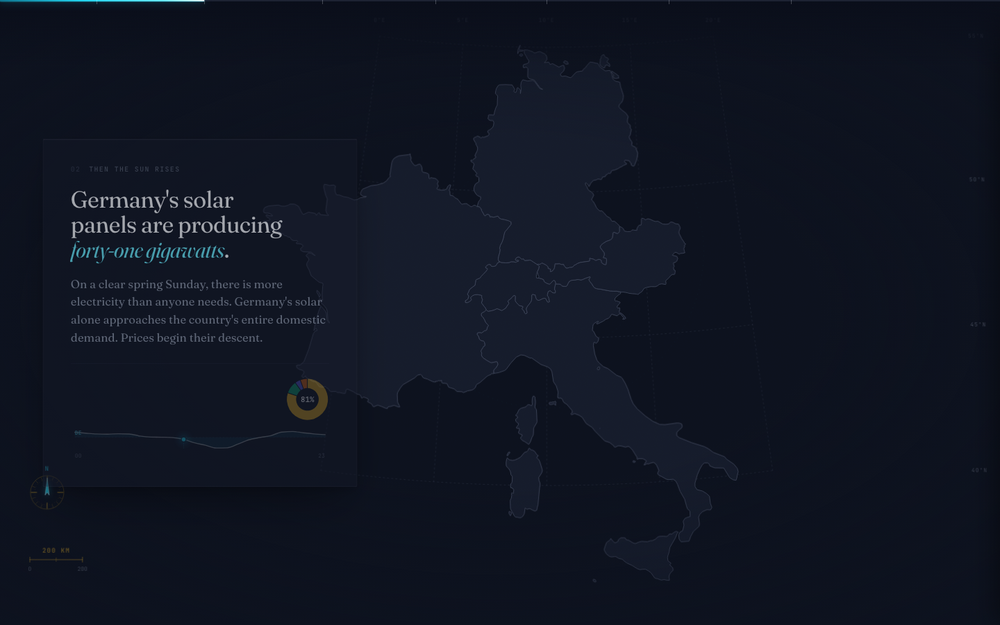

# The Price of Wind and Sun

An interactive scrollytelling visualisation of how Germany's renewable build-out is reshaping wholesale electricity prices across Switzerland, France, Italy and Austria.

**[→ View the live site](https://com-480-data-visualization.github.io/HSquareB/)**



## About

On a sunny Sunday in May 2024, German solar farms pushed so much power onto the continental grid that Switzerland's wholesale electricity price crashed to **−€145.12 per MWh at 13:00**, deeper in the red than Germany itself at the same hour. Switzerland barely produces solar. Italy, two interconnectors away, was still paying positive prices.

The piece walks the reader through that afternoon on a shared dark-themed map, explains the mechanism (merit-order pricing, interconnector flow, duck curve dynamics), and then releases them into an interactive explorer that covers the full eighteen months of hourly data.

## Highlights

- Seven-step scroll narrative on a sticky five-country map (CH, DE-LU, FR, IT-NORD, AT)
- Interactive explorer: timeline scrubber, play / pause, click-to-inspect country sidebar, price-vs-renewable-share colour toggle
- Four chart modules: calendar heatmap, generation stack, daily price profile, small multiples
- Reproducible Python pipeline: raw CSV → six JSON aggregates in under a minute
- Dark-mode-only visual system with diverging ice-white price scale, Fraunces × JetBrains Mono typography

## Tech stack

| Layer | Tool |
|---|---|
| Rendering | D3 v7 (SVG + Canvas), vanilla ES modules |
| Scroll | Scrollama v3 |
| Map | `world-atlas` TopoJSON, filtered to five countries (17 KB) |
| Preprocessing | Python 3.9, pandas, pyarrow |
| Hosting | GitHub Pages (static, `docs/` folder) |

No framework, no build step. The site is served as plain static files.

## Dataset

[European Electricity Price and Generation, 2024–2025](https://transparency.entsoe.eu/) — the ENTSO-E Transparency Platform. 301,391 hourly rows across 23 European bidding zones, day-ahead prices and generation by fuel. The raw CSV is committed once and treated as immutable:

```text
data/entsoe_data_2024_2025.csv
```

Every derived artefact under `docs/data/processed/` is regenerated by the scripts in `scripts/`.

## Running locally

Python 3.9 or newer is the only hard prerequisite. Everything else is served by CDN.

```bash
# Python environment
python3 -m venv .venv
.venv/bin/pip install -r requirements.txt

# Rebuild the five-country TopoJSON (optional, already committed)
.venv/bin/python scripts/build_topojson.py

# Run the dataset diagnostic — prints distribution, correlations, headline figures
.venv/bin/python scripts/explore.py

# Regenerate every JSON artefact under docs/data/processed/
.venv/bin/python scripts/preprocess.py

# Serve the site from the repo root
python3 -m http.server 8000
# then open http://localhost:8000/docs/
```

## Project structure

```text
HSquareB/
├── data/
│   └── entsoe_data_2024_2025.csv     raw ENTSO-E download (immutable)
├── scripts/
│   ├── build_topojson.py             five-country map geometry builder
│   ├── explore.py                    dataset diagnostic
│   └── preprocess.py                 CSV → JSON pipeline
├── docs/                             the site itself, served by GitHub Pages
│   ├── index.html
│   ├── data/processed/               committed JSON artefacts
│   ├── css/style.css
│   └── js/
│       ├── main.js                   entry point, scroll orchestration
│       ├── map.js                    D3 map module
│       ├── narrative.js              per-step handlers
│       ├── explorer.js               interactive explorer
│       ├── charts/                   chart factories
│       └── utils/                    colour scale, data loaders
├── milestone_1/milestone1.pdf
├── milestone_2/
│   ├── milestone2.md                 design document
│   └── figures/                      prototype screenshots
├── requirements.txt
└── README.md
```

## Team

| Name           | SCIPER  |
|----------------|---------|
| Brian Banna    | 356437  |
| Lê Thào Huyèn  | 355566  |
| Hajj Hannah    | 346545  |

For simplicity and to avoid merge conflicts, most commits were pushed from a single account. The division of work is documented in the milestone 2 report.

Built for COM-480 Data Visualization, EPFL, Spring 2026.
