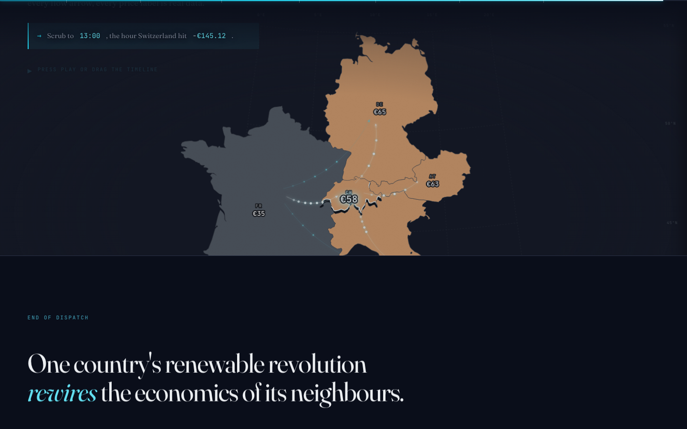

# The Price of Wind and Sun

**Team HSquareB** &nbsp;·&nbsp; Brian Banna (356437), Lê Thào Huyèn (355566), Hajj Hannah (346545)
**COM-480 Data Visualization** &nbsp;·&nbsp; Milestone 2 &nbsp;·&nbsp; 1 May 2026

`Live prototype  https://com-480-data-visualization.github.io/HSquareB/`
`Source code     https://github.com/com-480-data-visualization/HSquareB`

---

## 1. Project goal

### 1.1 Thesis

Germany's renewable build-out is no longer a German story. On a sunny Sunday in May 2024, German solar farms pushed so much power onto the continental grid that Switzerland's wholesale electricity price crashed to -€145.12 per MWh at 1 pm, deeper into the red than Germany itself at the same hour. Switzerland barely produces solar. Italy, two interconnectors away, was still paying positive prices. One country's energy transition is setting the clearing price for five.

We want the reader to feel that transmission of shock, not just read about it.

### 1.2 Motivation

Renewable integration is usually told as a domestic success story: capacity installed, emissions avoided, bills saved. The cross-border side of the story is quieter and harder to show. Interconnectors turn national energy policy into a continental externality. When they work well, they smooth out weather. When supply overshoots demand, they broadcast a price shock across the network in minutes. Policy-makers, grid operators and energy-literate readers all benefit from seeing that mechanism explicitly, and seeing how it has deepened between 2024 and 2025.

### 1.3 Questions we want a reader to walk away able to answer

- Does Germany's solar peak reach into the price formation of its neighbours?
- Which of those neighbours absorb the shock hardest, and why?
- How fast has this pattern intensified across the eighteen-month window?
- Who is insulated from it, and what insulates them?

### 1.4 Audience

Energy-literate general readers, undergraduate economics and energy students, and anyone following the European power-market news cycle. The piece assumes no meteorology and no electricity-market background beyond "wholesale prices exist." All technical terms are introduced inline when first used.

---

## 2. Exploratory data analysis

The raw data is the ENTSO-E Transparency Platform download covering 1 January 2024 through 30 June 2025: 301,391 hourly observations across 23 bidding zones with day-ahead prices and generation split by fuel. We filter to the five coupled central-European zones at the heart of our story: Switzerland (CH), Germany and Luxembourg (DE_LU), France (FR), Northern Italy (IT_NORD), and Austria (AT).

### 2.1 Distribution of negative-price hours

The simplest signal is how often each market clears below zero. Over eighteen months:

| Country | Negative-price hours | Share of total |
|---|---:|---:|
| Germany (DE_LU) | 846 | 6.4% |
| Switzerland (CH) | 529 | 4.0% |
| Austria (AT) | 471 | 3.6% |
| France (FR) | 123 | 0.9% |
| Italy (IT_NORD) | 4 | 0.03% |

The ordering is not random. It tracks interconnection capacity to Germany and proximity to German solar. Italy, separated from the German-Austrian block by the Alps and with more gas in the mix, barely sees zero. Switzerland has almost no solar of its own but absorbs 529 hours of negative prices, more than half of Germany's count.

### 2.2 Correlation between the Swiss and German price

On 88.8% of the hours where Switzerland went negative, Germany was also negative in the same hour. The two markets move together at the bottom of the price distribution. This is the statistical spine of the project: Switzerland is not producing its own negative-price hours, it is importing them through the physical grid.

### 2.3 The duck curve is widening, fast

We computed the monthly average price profile for each country across all eighteen months. Germany's average midday price (hour 13) fell from +€21.42 per MWh in May 2024 to -€3.86 per MWh in May 2025. Year on year, the duck's belly has dropped below zero on a monthly-average basis. That happened in one year.

All five countries share the same daily shape: a midday trough at hour 13 or 14, an evening peak at hour 19. What differs is absolute level and how deep the trough goes. The story Step 7 tells is "same rhythm, five different intensities", which we only noticed after running the EDA and seeing that peak hours lined up across the board.

### 2.4 Seasonality of renewable share

Germany's monthly renewable share (solar + wind + hydro as a fraction of total generation) peaks above 70% in the summer months of 2024 and rises higher in 2025. Italy stays heavily gas-dependent throughout. Austria runs near 80% year-round, mostly hydro. France sits at a stable 20 to 30%, nuclear-dominated, with fossil fuels as a buffer. These five mixes produce five different price personalities, which is what the narrative has to surface.

### 2.5 Three insights the visualisation is built around

1. **Coincidence.** Swiss and German negative hours line up 88.8% of the time.
2. **Inversion.** At 13:00 on 12 May 2024, Switzerland cleared below Germany. The price shock can over-shoot in the importing market.
3. **Evolution.** The midday collapse has sharpened between May 2024 and May 2025 on a monthly-average basis, not just in outlier hours.

Each of the three shows up explicitly in one of the seven narrative steps.

---

## 3. Visualisation plan

### 3.1 Architecture

The piece runs as a single scrollytelling page with a sticky map underneath. The five-country map is the shared canvas. The reader scrolls through seven editorial cards, each of which changes the map's state: time of day, price colouring, flow arrows, annotations. After the seventh card, the scroll releases into an interactive explorer where the reader can drive the same map directly.

Because the prototype is already functional end to end, we include screenshots of the live build rather than the sketches named in the brief. The artefact itself is the most faithful representation of what we intend to ship.

### 3.2 The seven narrative steps

| Step | Beat | Key visual |
|---|---|---|
| 1 | Midnight baseline. Calibrate the reader on the map, colour scale, and legend. | Five-country map, muted prices, clock at 00:00. |
| 2 | Dawn solar ramp. Germany wakes up; the mix donut shows solar dominance. | Map tints, generation donut pinned beside DE. |
| 3 | **The peak moment.** 13:00, 12 May 2024. Switzerland at -€145.12, below Germany. Flow arrows radiate from DE and out of CH. | Ice-white CH, flow arrows, hero number bloom. |
| 4 | Year in one view. Calendar heatmap of every hour in 2024 and 2025 for DE and CH, toggleable. | Canvas heatmap, 13,140 cells per country. |
| 5 | Merit-order stack. Germany's generation stack for the showcase day with price overlay and load line. | Stacked area + line chart, animated reveal. |
| 6 | Duck curve forming. Monthly cycling of Germany's profile from January 2024 to June 2025 over a ghost annual average. | 24-hour line chart, animated month transitions. |
| 7 | Five identities. Small-multiples grid of all five countries' annual profiles. | 3-by-2 grid of compact 24-hour line charts. |

### 3.3 Interactive explorer

After the guided story, the reader can drive the map themselves. A timeline scrubber covers one full showcase day in hourly steps. Playback runs at 1x, 2x or 4x speed, with Space and the arrow keys as keyboard shortcuts. Clicking any country opens a sidebar showing that country's generation stack, daily price profile with the annual average as a ghost line, and summary stats (current price, renewable share, spread to Italy). A colour-mode toggle recolours the map by renewable share instead of price.

### 3.4 Visual language

The piece runs dark-only. The background is a three-level navy ramp; the price scale is a diverging sequential from ice-white (deep negative, where it matters most) through the navy baseline to warm orange and red for positive peaks. Ice-white for the extreme negatives is a deliberate inversion of the usual "darker equals more extreme" convention: the point is that negative prices are unnatural, and we want them to glow. Typography pairs Fraunces (variable serif, used at display sizes for the hero numbers and editorial copy) with JetBrains Mono (for every data value, timestamp, country code, and legend). Numbers never appear in the serif. The choice is grounded in Lecture 6.1 (perception and colour) for the palette reasoning and Lecture 7.1 (designing visualisations) for the typographic hierarchy.

---

## 4. Plan of attack

### 4.1 Minimum viable product

All of the following are already working in the live prototype:

- Five-country map rendered from a 17 KB TopoJSON with price-driven colouring and flow arrows
- Seven-step narrative scroll wired through Scrollama, with per-step map state changes
- Timeline scrubber on the explorer with play / pause, speed control, and keyboard shortcuts
- Reproducible Python pipeline that regenerates every JSON artefact from the raw CSV
- Click-to-inspect country sidebar with generation stack, daily profile, and summary stats
- Price vs renewable-share colour toggle

### 4.2 Stretch ideas

Ranked by how much they would add if we have time before Milestone 3, each of which can be dropped without breaking the core argument:

- **Guided-tour auto-play** that scrolls the piece itself with subtitles, for the screencast and for non-scrolling viewers.
- **Keyboard accessibility on the map** so every country can be reached with Tab and opened with Enter.
- **Graceful empty states and error messaging** across all charts.
- **Colour-vision-deficient audit** of the generation-stack palette (solar and gas currently sit close in CVD space).
- **Annotation layer** for named events: German holidays, negative-price records, winter Dunkelflaute hours.
- **Sonification of one day's price curve** as an optional audio track, grounded in Lecture 11.2.

The first three are already in progress. The remaining three are honest stretch.

### 4.3 Tools

| Component | Tool |
|---|---|
| Data preprocessing | Python 3.9, pandas, pyarrow |
| Map geometry | world-atlas (Natural Earth), topojson-client |
| Rendering | D3 v7 (SVG and Canvas), vanilla ES modules |
| Scroll orchestration | Scrollama |
| Typography | Fraunces (variable serif), JetBrains Mono |
| Hosting | GitHub Pages (static, `/src` folder, `.nojekyll`) |

No framework, no build step. The whole site is served from static files on GitHub Pages.

### 4.4 Course lectures

Past lectures used in the work so far:

- **1.1 Introduction to data viz** and **1.2 Web dev**: project framing, scaffolding.
- **2 JavaScript** and **3 More JavaScript**: vanilla ES modules, DOM work, no jQuery.
- **4.1 Data** and **4.2 D3**: joins, scales, transitions, stacked areas, small multiples.
- **5.1 Interaction** and **5.2 More interactive D3**: timeline scrubber, sidebar open/close, hover affordances.
- **6.1 Perception and colours**: price scale design, ice-white zero-crossing, dark-mode contrast choices.
- **6.2 Mark and channel**: encoding trade-offs for the generation stack and the flow arrows.
- **7.1 Designing viz** and **7.2 Do and don'ts**: hierarchy, typography pairing, pitfalls avoided (no 3D, no pie slices beyond the one-shot solar donut in Step 2).
- **8.1 Maps** and **8.2 Practical maps**: conic-conformal projection centred on Munich, TopoJSON for five countries only, flow-arrow layer.

Future lectures we expect to lean on for Milestone 3:

- **9 Text**: annotation layer and final labelling pass.
- **10 Graphs**: formalisation of the flow-arrow layer as a directed network between bidding zones.
- **11.1 Tabular data**: sidebar summary tables, final polish.
- **11.2 Sound viz**: optional sonification stretch idea.
- **12.1 Storytelling**: final editorial pass on card copy, pacing, and transitions.
- **12.2 Beyond visualisation**: process-book reflections.

### 4.5 Prototype status

The end-to-end prototype is live at [https://com-480-data-visualization.github.io/HSquareB/](https://com-480-data-visualization.github.io/HSquareB/). All seven narrative steps are wired, the explorer is interactive, and the Python pipeline regenerates every JSON artefact from the raw CSV in under a minute. The current phase is polish and accessibility (13 of 17 tasks done), which will continue through to Milestone 3 alongside the screencast and the process book.

### 4.6 Division of labour

| Member | Primary ownership |
|---|---|
| Brian Banna | Data pipeline (Python, ENTSO-E to JSON). Front-end engineering: D3 chart modules, scroll orchestration, map rendering, interactive explorer. |
| Lê Thào Huyèn | Narrative design and storytelling: the seven-step structure, card copy, hero-moment framing, pedagogical sequencing. Early sketches and reading-flow decisions. |
| Hajj Hannah | Exploratory data analysis, visual design system: colour palette, typography pairing, small-multiples visual language. Early sketches and page composition. |

Sketching and storytelling were shared across all three members in the design phase. Ownership in the table reflects who led each domain through to shipped code or shipped copy.
